# 2023 Chippewa Facility Survey - 5 interesting insights

In June 2023, Chippewa Local Schools did a survey to get feedback on potential plans for facility redevelopment, as well as to gauge the general view of district residents on recent actvities within the district. The survey was done entirely online, with district residents notified through Final Forms, the school district website and Facebook pages, as well as the digital sign at the town square. 

515 responents completed the survey. The majority of respondents were female (70%), have had or currently have children in the district (82% / 75%), and are aged 26-45 (61%) or 46-65 (32%). One thing to note is that the class of respondents did not reflect the general demographic mix based on the November 2022 election results, and that the number of respondants was less than 10% of the registered voters within the district. While filtering by different demographic groups did not produce significantly different results, the small data set makes it hard to have any meaningful insights for those group.

The survey however had some interesting findings. Here are 5 interesting insights from the survey results.

## District residents in favor of moving all K-6 students into one building

With the topic of facility redevelopment being in focus, a key question is how favorable consolidating to a single K-6 building would be. Over 70% of respondants responded either 'Highly Agree' or 'Agree'.

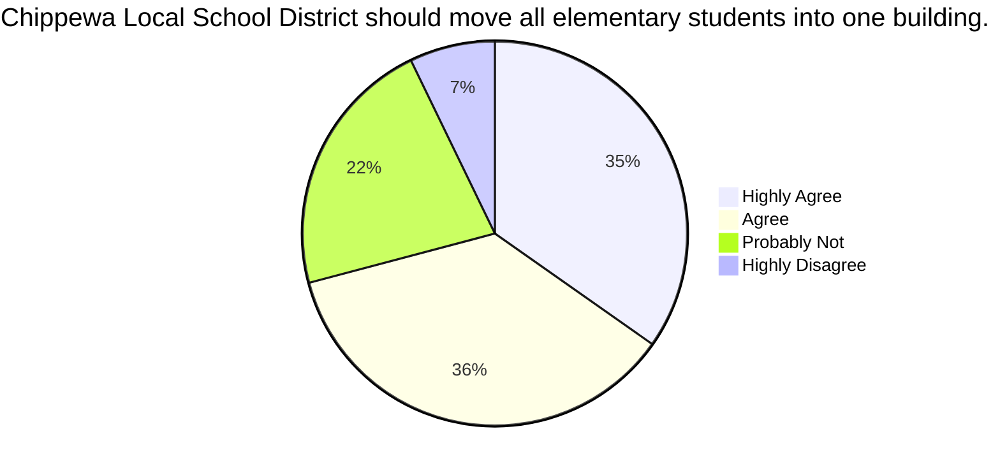

Interestingly, most of those answering 'Probably Not' or 'Highly Disagree' to that question did not favor maintaining the current CIS and Hazel Harvey buildings. With nearly 30% of respondents not favoring consolidating to a single K-6 building, there is likely a preference for nearly 20% of respondents to rebuild both HH and CIS as separate buildings.

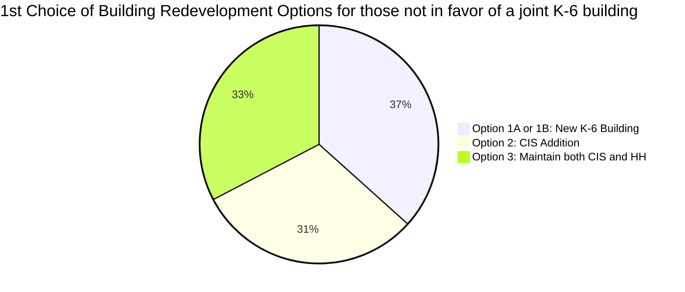

## Preference for a new building to replace Hazel Harvey and CIS

The plurality of respondents favored one of the two new building options to replace Hazel Harvey and CIS; 52% favored a new building, while 31% favored an addition to CIS and 17% favored maintaining the current buildings. Of those favoring a new building, nearly 70% of those respondants favored a bond issue versus waiting to leverage an OFCC partnership.

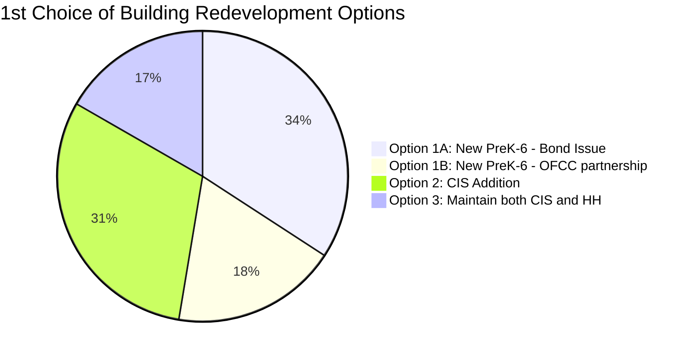

Generally, respondents that picked Option 1A or 1B as their preferred option picked the other of 1A or 1B as their second option, solidifying the preference for a new building versus an addition on CIS or maintaining both buildings.

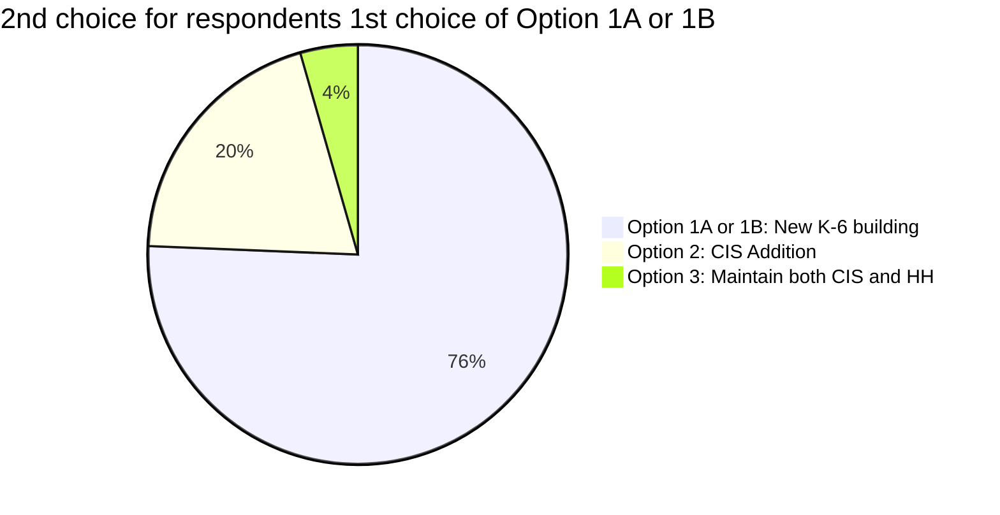

40% of respondents did not have either "Option 2: CIS Addition" or "Option 3: Maintain both CIS and HH" in their top two preferences, while 55% had "Option 2: CIS Addition"  and 33% had "Option 3: Maintain both CIS and HH" in one of the top two options. 

## Mixed views on all facilities needing to be on one property

A big trend in school district facilities re-development is putting all school facilities on a single campus. Respondents to this survey were mixed on that as a strategy for the district; 58% responded either 'Highly Agree' or 'Agree' to having all schools on one campus, and 48% responded either 'Highly Agree' or 'Agree' to having all Athletic Facilities on the same campus. This could be due to the cost-consiousness of the respondents, or the potential challenges of doing such a relocation.

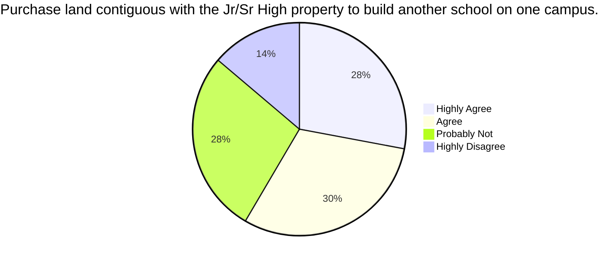

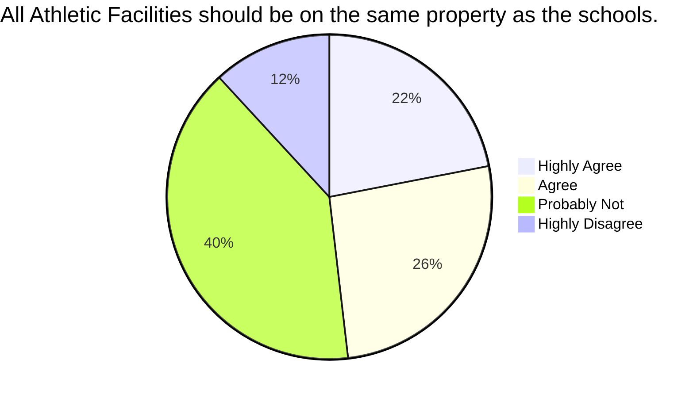

Combing the insights from the previous section on the preference for a new K-6 building versus adding on to existing buildings, one could see that building on existing district property is preferred by district residents.

## District Residents want 21st-century schools and updated athletic facilities compared to other Wayne County schools

There were additional questions on the respondents desire for 21st Century schools and Athletic Facilities on par with other Wayne County schools. Nearly 90% of respondents responded either 'Highly Agree' or 'Agree' on the district having 21st Century schools, and 85% responded either 'Highly Agree' or 'Agree' on having Athletic Facilities on par with other Wayne County schools. 

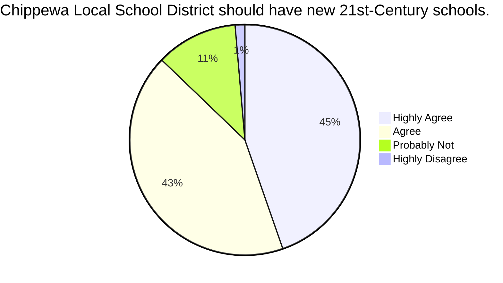

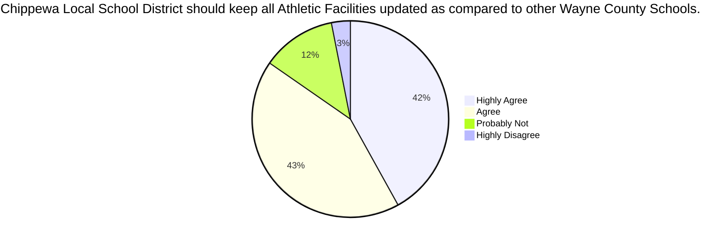

Considering the respondent class was predominately indivuduals heavily engaged in the school district, the results are not overly surprising. However, it is a good metric to indicate that those who do leverage our schools do see the need to strong facilities.

## Hazel Harvey issues are well known; investments in facilities not as well known

Not surprisingly, nearly 90% of respondents knew of the challenges of the current Hazel Harvey building. This building has been a topic front and center in previous levy and bond issues, and hot topic within the community.

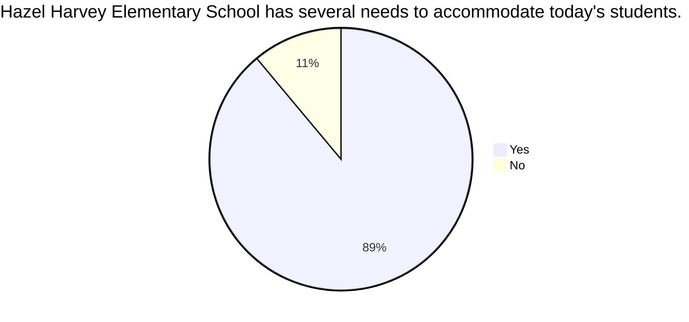

Less visible and "hot-button" issues had much less awareness amongst district residents. This is significant as the majority of respondents indicated the had students in the school presently; this likely could be due to a lack of communication on the topic, or that the upgrades themselves were not considered noteworthy by respondents.

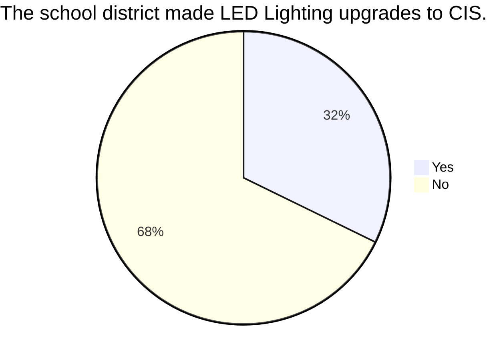

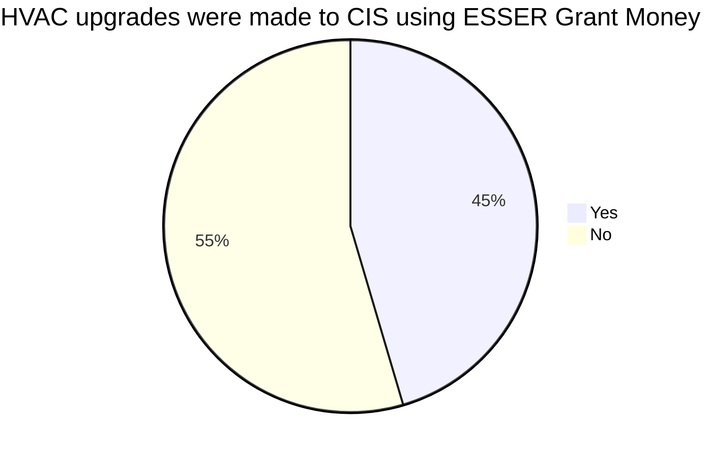

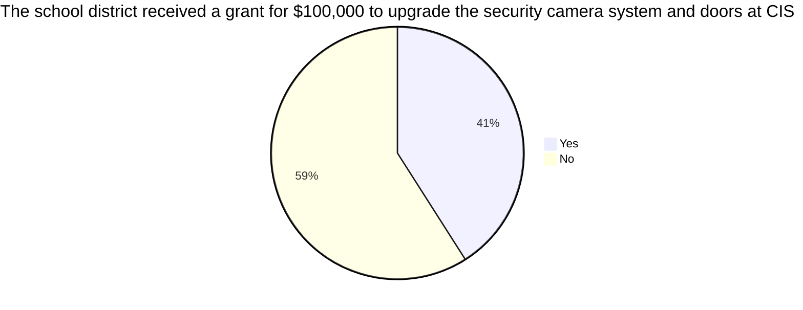

There was some awareness on the sale of the old Chippewa Middle School, but again lower than one would expect considering the class of respondents.

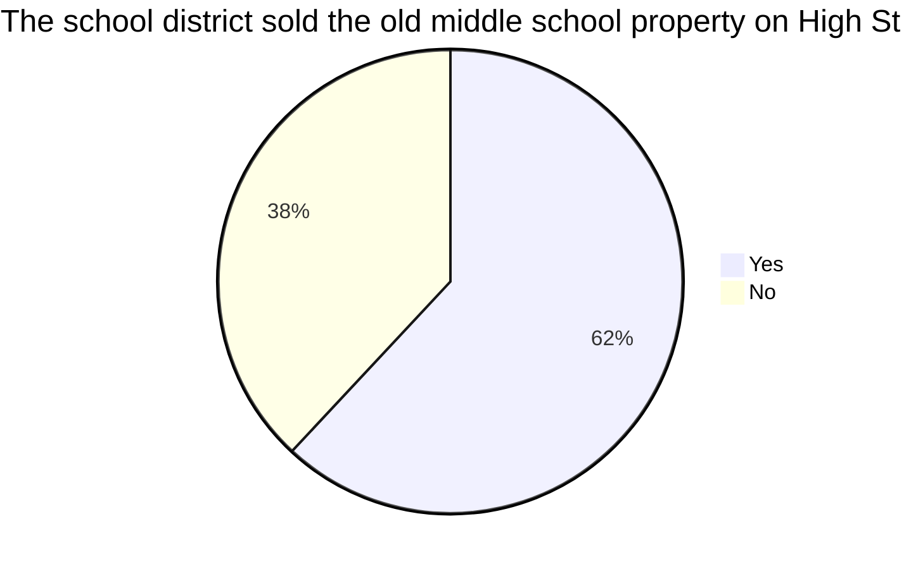

## Takeaways

Generally respondents agree that the current district facilities need to be redeveloped, with the general trend of building a new facility on existing district property. Again, with the skew of data towards respondents directly engaged in the district, it's hard to tell whether the larger community favors this approach; generally district residents have been more in favor of financially prudent in past levy and bond issues.

There was also some surprises on the lack of awareness of many of the facility investments made into the district. This could be an area to look more into how to best educate and inform on these investments, as there has been a view that the district has limited investment into it's facilities.

